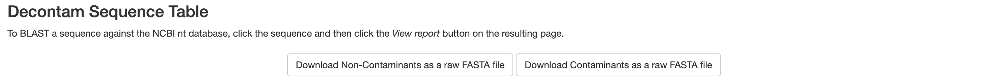

```{r setup, include=FALSE}
knitr::opts_chunk$set(echo = TRUE)
```

# Preamble

Decontam is a bioinformatics decontamination tool applicable to both amplicon and metagenomic sequencing data, that leverages the differing relative abundances of contaminants in control samples when compared to experimental samples as well as those samples with low biomass when compared to samples with high biomass. Contaminants within microbial measurements are a consistent and pervasive issue within the field. These contaminants have the capacity to impact taxonomic assignments, relative abundance calculations and even promote the existence of non-existent taxa which can lead to incorrect assumptions and interpretations. This is of grave concern particularly in a low-biomass environment as the impact of these contaminants is heightened due to the low amount of starting biological material from the target community. Decontam seeks to remedy this by removing contaminants at the Feature level but before relative abundance calculations. This tool was developed and maintained by [Benjamin Callahan](https://github.com/benjjneb/decontam) and has been shown to be effective in identifying contaminants in datasets of various structures. Here we present Decontam functionality within q2-quality-control on the Qiime 2 platform, which for the rest of this document be referred to as q2-Decontam.

**Reference** [Davis, N. M., Proctor, D. M., Holmes, S. P., Relman, D. A. & Callahan, B. J. Simple statistical identification and removal of contaminant sequences in marker-gene and metagenomics data. Microbiome 6, 226 (2018).](https://microbiomejournal.biomedcentral.com/articles/10.1186/s40168-018-0605-2#ethics)

# QIIME 2 Basics

-   If you're completely new to QIIME 2, we recommend reading [Getting Started with QIIME 2](https://amplicon-docs.qiime2.org/en/latest/explanations/getting-started.html) to familiarize yourself with concepts that may be helpful.

-   To export any of the objects used within the tutorial, the `qiime tools export` actions the documentation for which can be found [here](https://docs.qiime2.org/2024.10/tutorials/exporting/)

# Installation and base actions

Q2-Decontam functionality is included in the base Amplicon and Metagenomic QIIME 2 distributions under the quality-control umbrella. Q2-Decontam consists of two main actions:

-   `qiime quality-control decontam-identify`

-   `qiime quality-control decontam-score-viz`

The `decontam-identify` action produces a QIIME 2 object containing the Decontam Scores for each feature in the dataset. This object is then passed into the `decontam-score-viz` action to visualize the distribution of decontam scores and help determine where the threshold should be set to eliminate the majority of contaminants but not remove true features from the data. To remove contaminants you will need to utilize `filter-table` actions. To install a local version of QIIME 2 via conda you can find installation instructions [here](https://docs.qiime2.org/2024.10/install/native/).

# Tutorial and Walkthrough

## Setup

This tutorial will include example commands with data that can be found below:

Feature Data Table \| [`table.qza`](https://github.com/jordenrabasco/q2-decontam-tutorial/raw/main/data_objs/table.qza "download")\
Representative Sequence Table \| [`rep_seqs.qza`](https://github.com/jordenrabasco/q2-decontam-tutorial/raw/main/data_objs/rep_seqs.qza "download")\
To get the associated metadata file for the example data you will need to run the below command:

```{r, engine = 'bash', eval = FALSE}
wget https://github.com/jordenrabasco/q2-decontam-tutorial/raw/main/data_objs/metadata.tsv
```

## Decontam-Identify

The first action that will be run is `decontam-identify`. This action runs the functionality of the base decontam application. You will need to decide which method of decontam you would like to run; Frequency, Prevalence, or Combined. An in depth explanation of the functionality of each method can be found [here](https://benjjneb.github.io/decontam/vignettes/decontam_intro.html)\
Once you have decided which method to use make sure that you have the correct metadata. Each decontam method requires unique metadata to run appropriately. The frequency method requires that each sample processed has corresponding concentration information. This information allows identification of contaminants through the simple idea that contaminants will be in greater relative abundance in low concentration samples than in high DNA concentration samples.\
The prevalence method requires control samples to be included in the dataset being analyzed. These control samples need to be identified via a metadata column that differentiates them from experimental samples. This method works on the premise that contaminants will be in higher relative abundances in control samples than in experimental samples.\
The combined method as the name suggests utilizes facets of both aforementioned methods and combines them to form a composite decontam score. Just as each method has it's own unique metadata, each method also has its own unique parameters; those parameters unique to the frequency method have the prefix `--p-freq-` and those unique to the prevalence method have the prefix `--p-prev-`. The combined method uses all prevalence and frequency parameters.

**Arguments/Parameters**:

`--i-table`: Takes in a FeatureTable[Frequency] artifact such as an ASV or OTU table\
`--m-metadata-file`: Takes in a metadata file corresponding to the data being analyzed(needs to be tab delimited)\
`--p-method`: Denotes the method that will be used\
`--p-freq-concentration-column`: Denotes the metadata column that holds the concentration information of each sample\
`--p-prev-control-column`: Denotes the column in the metadata file contains the information on whether a sample is an experimental or a control sample\
`--p-prev-control-indicator`: Text within the `--p-prev-control-column` that identifies control samples\
`--o-decontam-scores`: Denotes the name of the output QIIME 2 object that will consist of a table of the decontam scores.\
\
**Frequency Method:**\
To run `decontam-identify` with the frequency method and the example data use the following command:\
*Note: The Frequency method is the only decontam method available when there are no control samples*

```{r, engine = 'bash', eval = FALSE}
qiime quality-control decontam-identify --i-table table.qza --m-metadata-file metadata.tsv --p-method frequency --p-freq-concentration-column Concentration --o-decontam-scores freq_decontam_scores.qza
```

The example output of the frequency method can be found [here](https://github.com/jordenrabasco/q2-decontam-tutorial/raw/main/data_objs/freq_decontam_scores.qza "download")\
\
**Prevalence Method:**\
To run `decontam-identify` with the prevalence method and the example data use the following command:

```{r, engine = 'bash', eval = FALSE}
qiime quality-control decontam-identify --i-table table.qza --m-metadata-file metadata.tsv --p-method prevalence --p-prev-control-column Sample_or_Control --p-prev-control-indicator control  --o-decontam-scores prev_decontam_scores.qza
```

The example output of the prevalence method can be found [here](https://github.com/jordenrabasco/q2-decontam-tutorial/raw/main/data_objs/prev_decontam_scores.qza "download")\
\
**Combined Method:**\
To run `decontam-identify` with the combined method and the example data use the following command:

```{r, engine = 'bash', eval = FALSE}
qiime quality-control decontam-identify --i-table table.qza --m-metadata-file metadata.tsv --p-method combined --p-prev-control-column Sample_or_Control --p-prev-control-indicator control --p-freq-concentration-column Concentration --o-decontam-scores comb_decontam_scores.qza
```

The example output of the combined method can be found [here](https://github.com/jordenrabasco/q2-decontam-tutorial/raw/main/data_objs/comb_decontam_scores.qza "download")

For clarity only one of these methodologies are needed to identify contaminants in your samples.

All methods will output a Qiime 2 object containing the decontam scores for the input feature table.

## Decontam-Score-Viz

The second action in the q2-Decontam workflow is `decontam-score-viz`. This action allows for visualization of the decontam scores in the form of a histogram and a decontam score table that includes the feature id, the determination of whether the sequence is a contaminant or not (based on the given threshold), the Decontam Score output from the Decontam algorithm, the corresponding read number for each feature (abundance), the number of samples in which the feature appears (prevalence) and the associated DNA sequence. This action was designed to assist in investigating contaminants and identifying which threshold to use when removing contaminants. To select an appropriate threshold for the data, the contaminant feature distribution within the histogram of decontam scores will need to be identified. Decontam score distributions are typically bimodial meaning that there are two "peaks" within the distribution. The peaks correspond to a sub-distribution of contaminant features and a sub-distribution of true features. A feature with a lower decontam score indicates that there is more evidence that the feature is a contaminant, the converse is true in that if a feature has a high decontam score; in that there is significant evidence that the feature is not a contaminant. Below is the histogram from the `decontam-score-viz` action using the example data provided in this tutorial.

::: {style="text-align:center"}

:::

\
The left side of the histogram (0-0.1 or 0.15) has a partial normal distribution ending at 0.1 or 0.15 with a small amplitude, this is indicative of a typical contaminant feature distribution within the overall decontam score histogram if the associated dataset has a low amount of contaminates. If a dataset has a larger amount of contaminants the partial normal distribution encompassing the lower decontam scores will increase in amplitude.\
Additionally, there are buttons in the visualization that allows for download of those features identified as non-contaminant or contaminant features as individual .fasta files for asynchronous investigations.

::: {style="text-align:center"}

:::

\
To investigate specific features within the experiment the following table is provided in the visualization. It is located below the histogram and the fasta download buttons:

::: {style="text-align:center"}

:::

**Arguments/Parameters**:

`--i-decontam-scores`: This is the output object from `decontam-identify` and is defined as a Collection[FeatureData[DecontamScore]]\
`--i-table`: Takes in a FeatureTable[Frequency] artifact such as an ASV or OTU table (same as input to `decontam-identify`)\
`--i-rep-seqs`: This takes in a FeatureData[Sequence] artifact, which is the artifact generated from uploading a .fasta file into a qiime environment.\
`--p-threshold`: This is the threshold at and below which features are designated as contaminants.\
`--p-weighted` / `--p-no-weighted`: These are the two options which explicitly indicate whether to weigh the histogram in the `.qzv` file by the read abundance. `--p-wegihted` indicates that the histogram will be weighted while `--p-no-weighted` will produce a histogram of the features instead of reads at each decontam score bin.\
`--p-bin-size`: This indicates what the bin size of the histogram in the `.qzv` output should be. It is recommend that the bin size be 0.05 for visualization of decontam score bimodal distribution.\
`--o-visualization`: The output `.qzv` file from the the action that can be visualized on the qiime serves which can be found [here](https://view.qiime2.org/)\
\
To run `decontam-score-viz` with the example data use the following command:

```{r, engine = 'bash', eval = FALSE}
qiime quality-control decontam-score-viz --i-decontam-scores comb_decontam_scores.qza --i-table table.qza --i-rep-seqs rep_seqs.qza --p-threshold 0.1 --p-no-weighted --p-bin-size 0.05 --o-visualization decontam_score_viz.qzv
```

The example output is a `.qzv` file, can be found [here](https://github.com/jordenrabasco/q2-decontam-tutorial/raw/main/data_objs/decontam_score_viz.qzv "download") and can be visualized locally via <https://view.qiime2.org/>

## Remove Contaminants Identified by Decontam

To remove the contaminant features use the `filter-table` actions. The code below, specifically the `--p-where` flag utilizes SQLite syntax to filter features or samples. The code below removes features whose decontam scores fall below a user defined threshold, in this case 0.1. To change the desired threshold, augment the 0.1 in the shown command to any value between 0-1. Those features that fall below the aforementioned threshold are treated as contaminants and removed from the feature table and the representative sequences table mentioned previously to assist in accurate, contaminant free downstream processing within the QIIME 2 environment such as phylogenetic tree generation. For more information on the filter-features plugin please visit their dedicated page [here](https://docs.qiime2.org/2024.10/plugins/available/feature-table/filter-features/).

```{r, engine = 'bash', eval = FALSE}
qiime feature-table filter-features --i-table table.qza --m-metadata-file comb_decontam_scores.qza --p-where '[p]>0.1 OR [p] IS NULL' --o-filtered-table filtered-table.qza
```

```{r, engine = 'bash', eval = FALSE}
qiime feature-table filter-seqs --i-data rep_seqs.qza --i-table filtered-table.qza --o-filtered-data filtered_rep_seq.qza
```

This will output two files the filtered feature table and the representative sequence table free of contaminants, and can be found [here](https://github.com/jordenrabasco/q2-decontam-tutorial/raw/main/data_objs/filtered-table.qza "donwload") and [here](https://github.com/jordenrabasco/q2-decontam-tutorial/raw/main/data_objs/filtered-rep-seqs.qza "download") respectively.

Please feel free to reach out to me at [jrabasc\@ncsu.edu](mailto:jrabasc@ncsu.edu){.email} it you have any further questions!

Q2-Decontam Tutorial © 2025 by [Jorden Rabasco](https://github.com/jordenrabasco) is licensed under [CC BY 4.0](https://creativecommons.org/licenses/by/4.0/)